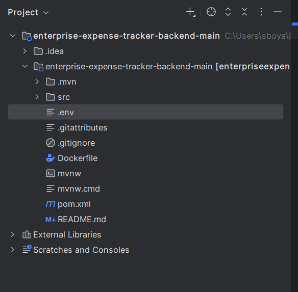
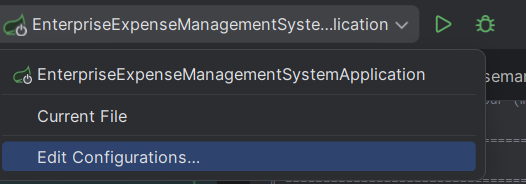
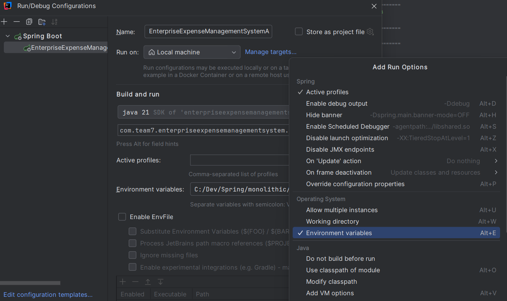
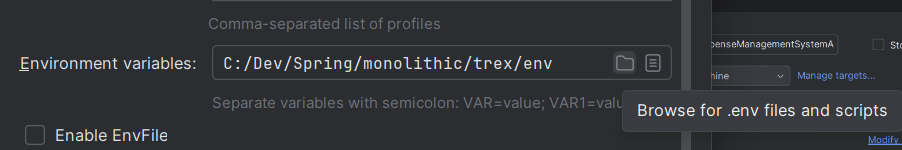

# Enterprise Expense Management System – Backend

## About the Project
The **Enterprise Expense Management System** is a robust backend application designed to manage and track enterprise expenses.  
It streamlines expense handling with features for employees, managers, and administrators, including:

- ✅ Expense submission & tracking
- ✅ Multi‑level approval workflow
- ✅ Analytics & reporting for insights

Built with **Spring Boot** and secured with **JWT authentication**, the system ensures scalability, maintainability, and enterprise‑grade security.

---

##  Features
-  **User Authentication & Role-Based Access** — secured with JWT
-  **Employee Expense Submissions** — with receipt/file attachments
-  **Manager & Admin Approval Workflows** — multi-level verification
-  **Expense Reports & Analytics Dashboards** — department/monthly trends
-  **Audit Logs & Activity Tracking** — compliance & transparency
-  **RESTful APIs** — easy frontend & third-party integration
-  **PDF Report Generation** — expense lists & summaries
-  **Email Delivery of Reports** — automated mailing of expense reports
-  **Work in Progress** — new features coming soon, open for collaboration 🤝
---

## 🛠️ Tech Stack
- **Backend Framework:** Spring Boot (Java)
- **Database:** PostgreSQL (or MySQL as alternative)
- **Authentication:** JWT (JSON Web Token)
- **Build Tool:** Maven/Gradle
- **Deployment:** Supports **Docker**, **Docker Compose**, and cloud platforms (AWS/GCP/Azure)

---

## ⚙️ Installation & Setup

### Prerequisites
- Java 17+
- Maven or Gradle
- PostgreSQL/MySQL running locally or on cloud
- Docker (optional, for containerized setup)

### Steps

# 1. Clone the repository
```bash
  git clone https://github.com/sagarboyal/enterprise-expense-tracker-backend.git 
  ```
# 2. Open the Project in an Editor
Open the cloned repository in your favorite editor (e.g., IntelliJ IDEA, VS Code).

###  3. Create a `.env` File
Create a `.env` file in the **root project folder**:



### 4. Add required `.env` properties

Here’s a sample `.env` configuration (replace with your values):

```dotenv
# =======================================
# 🗄️ Database Configuration
# =======================================
DB_URL=jdbc:postgresql://localhost:5432/postgres
DB_USERNAME=postgres
DB_PASSWORD=postgres
DRIVER_CLASS=org.postgresql.Driver
DB_DIALECT=org.hibernate.dialect.PostgreSQLDialect

# =======================================
# 🔐 JWT Configuration
# =======================================
JWT_SECRET=your_jwt_secret_key
JWT_EXP_TIME=3600000   # 1 hour (ms)

# =======================================
# 📧 Mail Configuration
# =======================================
MAIL_USERNAME=your_email@example.com
MAIL_PASSWORD=your_email_password

# =======================================
# 🌐 Frontend Integration (optional)
# =======================================
FRONT_END_URL=http://localhost:5173

# =======================================
# ☁️ Cloudinary Setup
# =======================================
CLOUD_NAME=your_cloud_name
API_KEY=your_api_key
API_SECRET=your_api_secret
MAX_FILE_SIZE=2MB
```
### 5. Configure it with your application configuration
 like in inteliJ

 

Then click on Modify option


Enable Environment Variable



Add Class Path where u place the `.env` file



---

## 🎉 Congratulations!

You’ve successfully set up and configured the **Enterprise Expense Management System - Backend**.

Now you can run your application and start managing expenses with ease:

```bash
 ./mvnw spring-boot:run
```